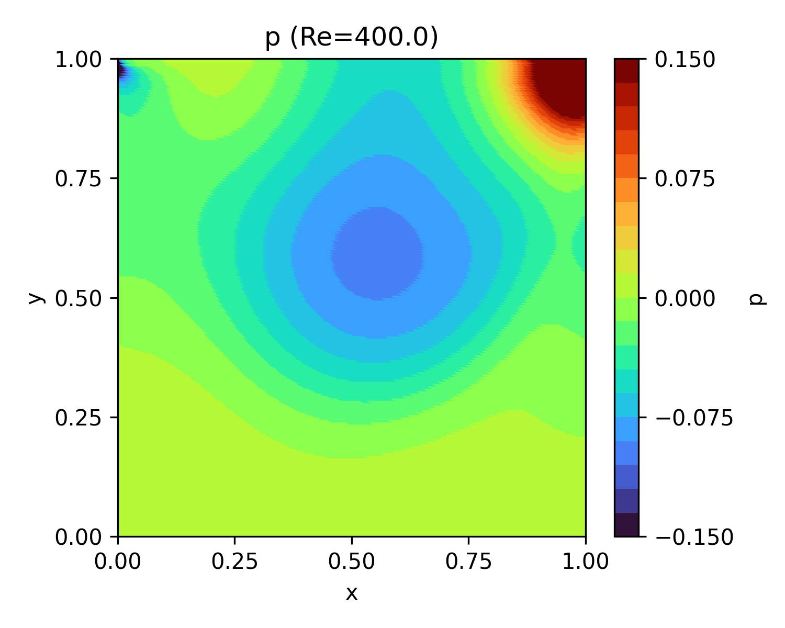
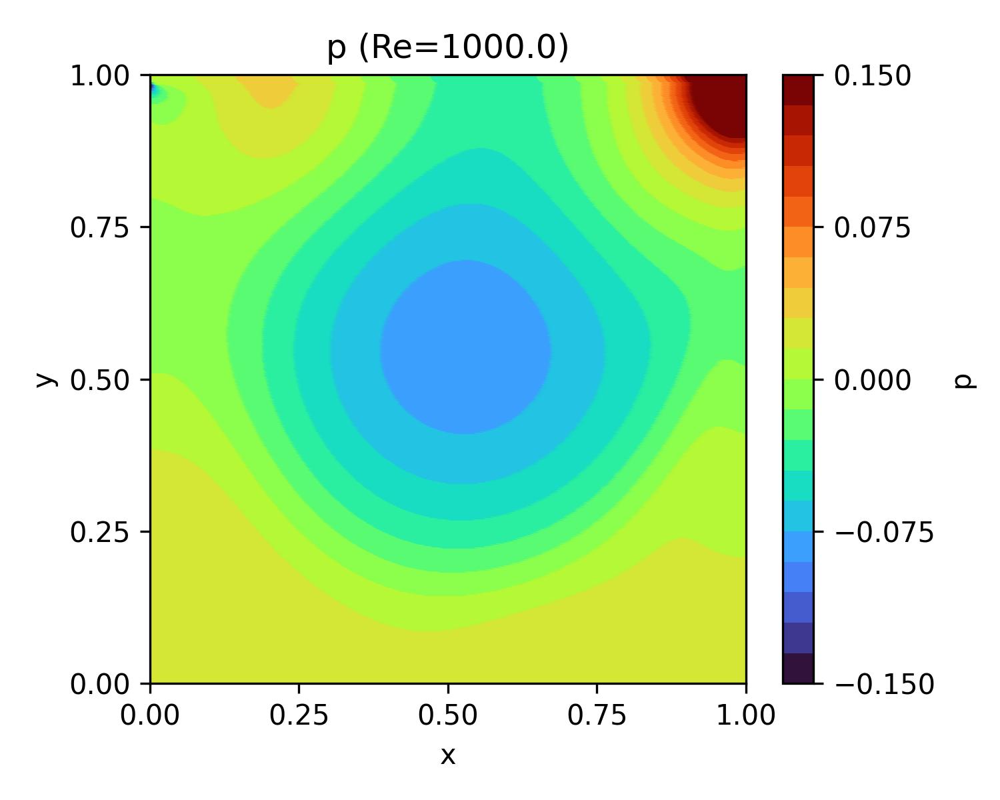

# Cavity_FDM_NumPy

Supplementary material for the final report of Computer Simulations (Winter Term 2022, Prof. Ono). 

FDM simulation based on fractional step method, KK scheme (4th-order approximation with 4th-order numerical viscosity) for convection, and 2nd-order central difference scheme for pressure gradient and viscosity terms. 

Compared with Ghia+1986: https://doi.org/10.1016/0021-9991(82)90058-4

u at the geometric center: https://gist.github.com/ivan-pi/3e9326d18a366ffe6a8e5bfda6353219

v at the geometric center: https://gist.github.com/ivan-pi/caa6c6737d36a9140fbcf2ea59c78b3c

## Results
Cavity flow is a steady problem. We consider that the field has reached to a steady state when the following is satisfied:
```math
\max \left( \frac{\| u^{(n+1)} - u^{(n)} \|_2}{\| u^{(n)} \|_2}, \frac{\| v^{(n+1)} - v^{(n)} \|_2}{\| v^{(n)} \|_2} \right) \le \delta
```
where $\delta$ is the convergence tolerance, set to $\delta = 10^{-6}$. 

The following sumamrizes results at different Reynolds numbers. 

Re: Reynolds number

t: dimensionless time required till the convergence (velocity residual $\le \delta$)

### $\Delta x = 5 \times 10^{-3}$
| Re | t | velocity norm | streamline | pressure | u at the geometric center | v at the geometric center |
|:---:|:---:|:---:|:---:|:---:|:---:|:---:|
| 100 | 15.4 |  |  |  |  |  |
| 400 | 26.8 |  |  |  |  |  |
| 1,000 | 36.4 |  |  |  |  |  |
| 3,200 | 87.5 |  |  |  |  |  |
| 5,000 | 148.5 |  |  |  |  |  |

### $\Delta x = 2 \times 10^{-3}$
| Re | velocity norm | streamline | pressure | u at the geometric center | v at the geometric center |
|:---:|:---:|:---:|:---:|:---:|:---:|
| 1,000 |  |  |  |  |  |
| 3,200 |  |  |  |  |  |
| 5,000 |  |  |  |  |  |


