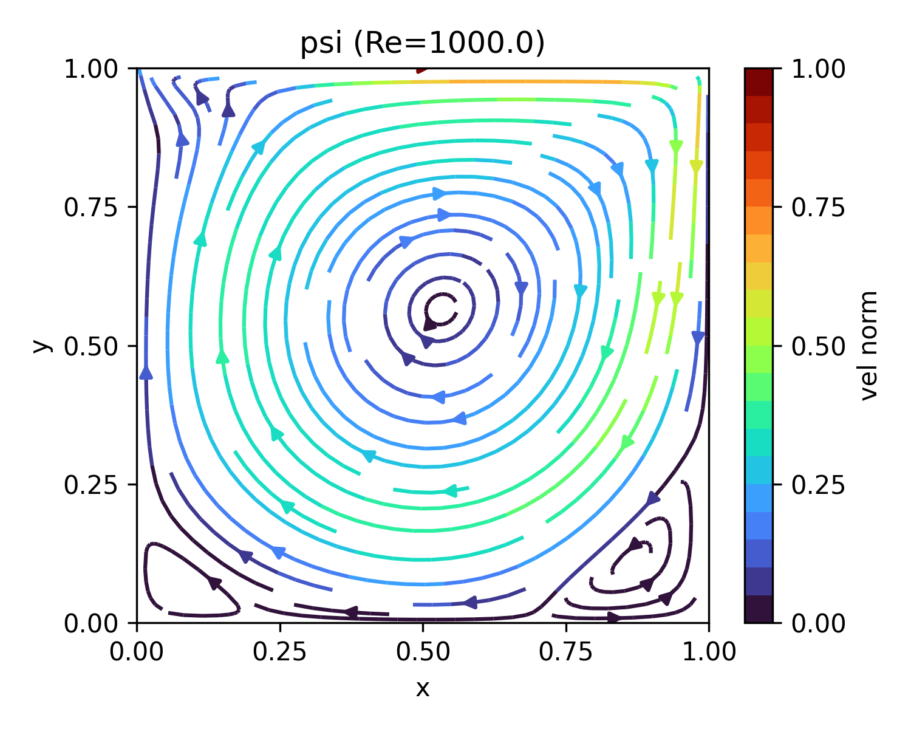

# 2D lid-driven cavity flow (FDM, NumPy implementation)

FDM (Finite Difference Method) simulation of 2D lid-driven cavity flow based on :
* fractional step method for time integration
* [Kawamura-Kuwahara scheme](https://doi.org/10.2514/6.1984-340) (3rd-order upwind -> 4th-order central with 4th-order numerical viscosity) for convection
* 2nd-order central difference for pressure gradient and viscosity terms

The results are compared with the reference solution (for velocity) presented in [Ghia+1986](https://doi.org/10.1016/0021-9991(82)90058-4). 

## Results
Cavity flow is a steady problem. We consider that the field has reached to a steady state when the following is satisfied:
```math
\max \left( \frac{\| u^{(n+1)} - u^{(n)} \|_2}{\| u^{(n)} \|_2}, \frac{\| v^{(n+1)} - v^{(n)} \|_2}{\| v^{(n)} \|_2} \right) \le \delta
```
where $\delta$ is the convergence tolerance, set to $\delta = 10^{-6}$. 

The following summarizes results at different Reynolds numbers and different resolutions. 

| Column name | Description | 
|:---:|:---:|
| $\text{Re}$ | Reynolds number (inertia vs viscosity) |
| $t$ | Dimensionless time until the convergence (when velocity residual $\le \delta$ is met) |
| $u(x=0.5)$ | Horizontal velocity along the geometric center |
| $v(y=0.5)$ | Vertical velocity along the geometric center |

### $\Delta x = \Delta y = 5 \times 10^{-3}$
| $\text{Re}$ | $t$ | Velocity norm | Streamline | Pressure | $u(x=0.5)$ | $v(y=0.5)$ |
|:---:|:---:|:---:|:---:|:---:|:---:|:---:|
| 100 | 15.4 |  |  |  |  |  |
| 400 | 26.8 |  |  |  |  |  |
| 1,000 | 36.4 |  |  |  |  |  |
| 3,200 | 87.5 |  |  |  |  |  |
| 5,000 | 148.5 |  |  |  |  |  |

### $\Delta x = \Delta y = 2 \times 10^{-3}$
| $\text{Re}$ | $t$ | Velocity norm | Streamline | Pressure | $u(x=0.5)$ | $v(y=0.5)$ |
|:---:|:---:|:---:|:---:|:---:|:---:|:---:|
| 100 | 13.7 |  |  |  |  |  |
| 400 | 19.2 |  |  |  |  |  |
| 1,000 | 30.7 |  |  |  |  |  |
| 3,200 | 68.4 |  |  |  |  |  |
| 5,000 | 134.1 |  |  |  |  |  |

## Requirements
Tested environment:
* numpy == 1.22.4
* matplotlib == 3.5.2

## License
MIT License
